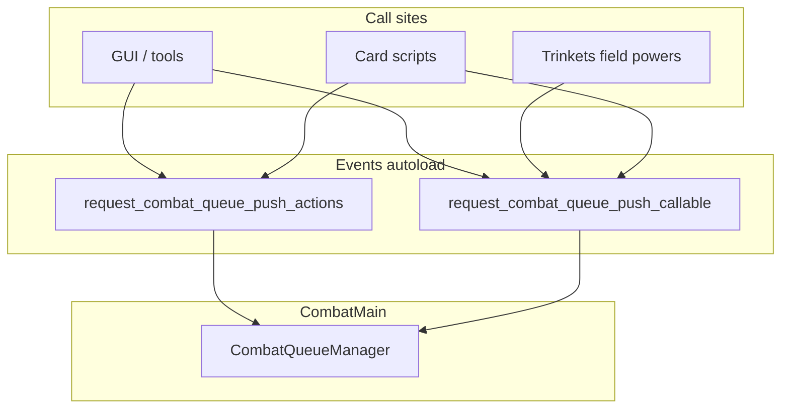

# Queued combat actions (CombatQueueManager + Events)

## Current behavior (what you have today)

- `**[scenes/main_game/combat/combat_main.gd](scenes/main_game/combat/combat_main.gd)**` connects `tool_manager.tool_application_started` to `_on_tool_application_started`, which calls `gui.toggle_all_ui(false)`.
- `**[scenes/GUI/combat_main/gui_combat_main.gd](scenes/GUI/combat_main/gui_combat_main.gd)**` `toggle_all_ui` disables hand + end turn and emits `ui_lock_toggled`.
- `**[ToolManager.apply_tool](scenes/main_game/tool/tool_manager.gd)**` runs pre-hooks, card actions, lifecycle, post-hooks; only one concurrent apply is safe.
- `**[ActionsApplier](scenes/main_game/action/actions_applier.gd)**` applies `Array` of `ActionData` with `combat_main`, `tool_card`, and `gui_tool_card_container` (needed for secondary selection and targets).
- `**GUICardFace.CardState.WAITING**` exists for secondary-selection UX; reuse for queued card plays.

## Target architecture

### CombatQueueManager (central place)

- Single owner of the **ordered queue** and a **serial async worker** (one item fully awaited before the next).
- Lives with **CombatMain** (member `RefCounted` or child Node): manager needs `CombatMain` reference to resolve combat context.
- API (internal or thin wrapper): `push_items(front: bool, items: Array[CombatQueueItem])` — if `front`, insert batch at head in correct order (see hook batching below); if `!front`, append batch to tail (matches `**request_combat_queue_push_actions(front, actions)`** argument order).
- Worker: `pop_front` / `remove_at(0)`, dispatch by item type, `await` completion.

### CombatQueueItem (what gets inserted)

Two **kinds** of items (subclasses, enum-tagged structs, or inner classes — match project style):

1. **Regular / ActionData item**
  - Holds (at minimum) an `Array` of `**ActionData`** intended for `**[ActionsApplier.apply_actions](scenes/main_game/action/actions_applier.gd)**`.  
  - Must also carry or resolve **execution context** that `apply_actions` needs today: `CombatMain`, `GUIToolCardButton` (`tool_card`), `GUIToolCardContainer`. For non-card-originated ActionData (rare), define explicit null/sentinel rules or a separate applier entry point.
2. **Script / Callable item**
  - Holds a `**Callable`** (or small script object) that the worker `**await`s** — used for anything **not** expressed as a flat `ActionData` pipeline, including:
    - **End turn** (wraps current `_end_turn` or equivalent).
    - **Skill card with `tool_script`** (today `[ToolApplier](scenes/main_game/tool/tool_applier.gd)` / script path).
    - **Power card** application path.
    - **Field status / player power / plant ability / player trinket** logic that does **not** go through `ActionsApplier` only (hooks, one-off async, UI-heavy slices).

**Composition:** A full “play this tool” may enqueue **one Callable** that internally runs the existing `apply_tool` sequence, **or** several items (Callable for pre-hook, ActionData batch for actions, Callable for discard) — migrate incrementally; the manager does not care as long as each item completes serially.

### Global events (`[autoloads/events.gd](autoloads/events.gd)`)

All combat queue insertions go through **signals** so callers stay decoupled from `CombatMain`:

1. `**request_combat_queue_push_actions(front: bool, actions)`**
  - `actions`: `Array` of `**ActionData**` (or a single wrapper the manager expands).  
  - `front`: when `true`, insert at head of queue (hook priority); when `false`, append (normal player backlog).  
  - Manager builds **ActionData**-flavored `CombatQueueItem`(s) and pushes accordingly.
2. `**request_combat_queue_push_callable(front: bool, callable: Callable)`**
  - Same `front` semantics as `request_combat_queue_push_actions`.  
  - Manager wraps `callable` in a **Callable** `CombatQueueItem`. If you need extra payload, use a bound Callable or a `CombatQueueItem` factory.

**CombatMain** (only while combat is active): connect these signals in `_ready` or `start`, and forward to its `**CombatQueueManager`** instance (validate `combat_main` is the active scene / disconnect on exit to avoid leaks).

### Ordering: `front` flag (user FIFO + hook priority)

- **Player intents** (next card, end turn): emit with `**front == false`** (`push_back`).
- **Hooks / urgent follow-ups**: emit with `**front == true`** (`push_front`).  
- **Multiple hooks in fixed order H1→H2:** prepend batch in reverse order, or one Callable that `await`s H1 then H2 (same as prior plan).

### Mapping existing hooks / flows

Rough pipeline today (still valid; items become queue entries or inner `await`s):

- Pre-tool: `handle_pre_tool_application_hook` → Callable item or inside “play card” Callable.
- Card actions: `ActionData` arrays → `**request_combat_queue_push_actions`** or wrapped inside one Callable that calls `ActionsApplier`.
- Post-tool / trinket / power hooks → `**request_combat_queue_push_callable(..., front: true)**` when they must preempt user backlog.

### UI and validation (unchanged intent from earlier plan)

- Relax global **toggle_all_ui** on every tool start; rely on **one worker** so model + animations stay aligned.
- Second card while first runs: **WAITING** state; enqueue via Events (CombatMain builds Callable or item that runs `apply_tool` for that `ToolData`).
- **Re-validate** energy / hand membership when dequeuing each play.
- `**_end_turn`**: enqueue as **Callable** item with `front: false` when player clicks end turn; runs after prior backlog unless you choose a different rule.

### 6. Integration notes

- `**ToolManager`:** May shrink to “deck + helpers” while **play** is triggered by queue Callable items; or `apply_tool` remains and is only invoked from the manager — avoid double entry.
- **Animations:** `[GUIToolCardAnimationContainer](scenes/GUI/main_game/tool_cards/gui_tool_card_animation_container.gd)` queue stays **below** this; combat queue decides **when** the next logical combat step begins.
- **Nightfall / turn-end cards:** Stay inside the end-turn Callable or follow-up items after end-turn Callable starts.

### 7. Tests (recommended)

- `push_actions` vs `push_callable` ordering with `front` true/false.
- Hook Callable `front: true` runs before a previously pushed `UseTool` Callable with `front: false`.
- ActionData item executes through `ActionsApplier` with correct mock context.
- End turn Callable runs after queued card Callable when enqueued in that order.

## Risks / decisions to confirm

- **Callable signature:** Standardize on e.g. `func (cm: CombatMain) -> void` async so the manager can `await callable.call(combat_main)`.
- `**request_combat_queue_push_callable`:** Signature is `front` then `callable`; only payload is via bound Callable if needed.
- **Autoload vs combat-only:** If `CombatMain` is absent, `request_`* handlers should no-op or assert once, to match other combat Events patterns.

