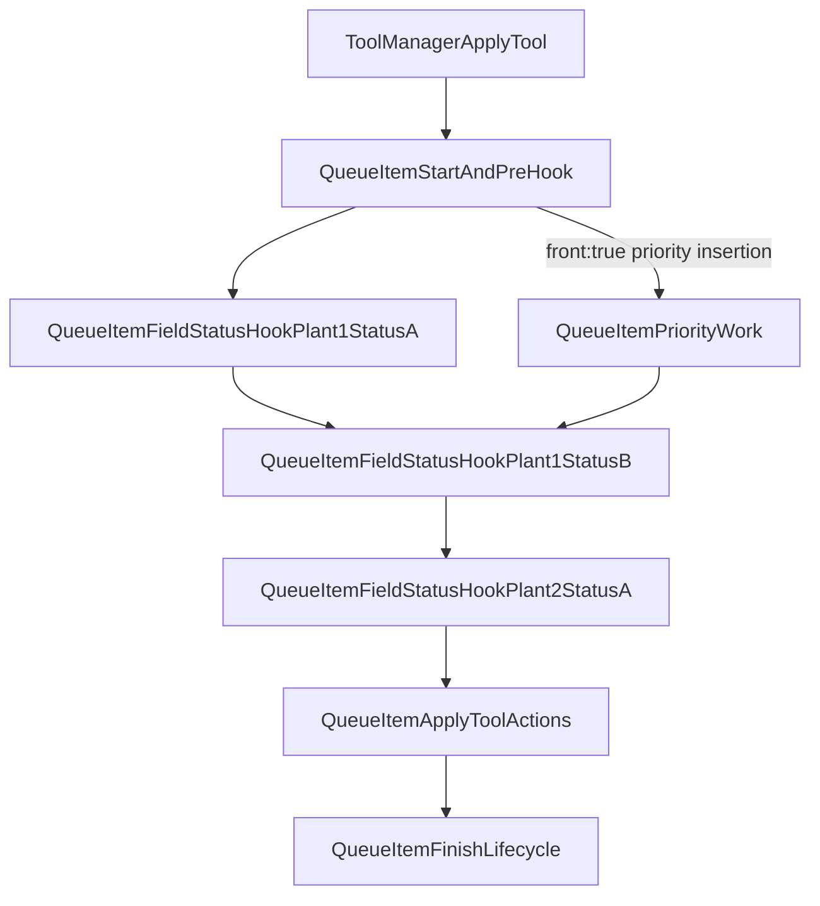

# Field Status Hooks as Per-Item Queue Work

## Goal
Convert field-status hook execution from batched loops into queue-native units, where each hook trigger is enqueued as its own callable item and executed in deterministic order.

## Scope and Behavior Target
- Preserve existing hook order semantics (`PlantFieldContainer` plant order + `FieldStatusContainer` status order).
- Preserve all existing side effects per hook: animation/message signals, stack reduction/removal, and status updates.
- Ensure queue interleaving works as intended (e.g. `front:true` priority items can run between individual field-status hook items).
- Avoid changing unrelated combat flow or card lifecycle semantics.

## Current Bottleneck (why this change)
- `ToolManager` currently awaits a batch hook runner in one stage: [`scenes/main_game/tool/tool_manager.gd`](/Users/cyang/works/current/garden/garden/scenes/main_game/tool/tool_manager.gd).
- Batch loops in [`scenes/main_game/combat/fields/plant_field_container.gd`](/Users/cyang/works/current/garden/garden/scenes/main_game/combat/fields/plant_field_container.gd) and recursive runners in [`scenes/main_game/combat/fields/status/field_status_container.gd`](/Users/cyang/works/current/garden/garden/scenes/main_game/combat/fields/status/field_status_container.gd) execute multiple hooks inside one queue item boundary.

## Implementation Steps

### 1) Add per-hook queue builders in `FieldStatusContainer`
- In [`scenes/main_game/combat/fields/status/field_status_container.gd`](/Users/cyang/works/current/garden/garden/scenes/main_game/combat/fields/status/field_status_container.gd), introduce APIs that return hook callables/items rather than executing all matches immediately.
- For each hook family (`tool_application`, `tool_discard`, `end_turn`, optionally `add_water` when queue-managed), expose:
  - a collector that filters matching statuses in current order;
  - one callable per matched status that performs the existing single-hook body (`_send_hook_animation_signals`, specific `handle_*`, `_handle_status_on_trigger`).
- Keep legacy `handle_*` methods temporarily as wrappers (for compatibility) until all call sites migrate.

### 2) Add plant-level queue builders in `PlantFieldContainer`
- In [`scenes/main_game/combat/fields/plant_field_container.gd`](/Users/cyang/works/current/garden/garden/scenes/main_game/combat/fields/plant_field_container.gd), add methods that flatten per-plant hook callables into one ordered list for queue enqueue.
- Replace loop-and-await entrypoints (`trigger_tool_application_hook`, `trigger_tool_discard_hook`, `trigger_end_turn_hooks`) with queue-oriented variants that either:
  - return ordered hook callables, or
  - directly emit `Events.request_combat_queue_push_callable` once per hook.
- Prefer return-list approach first (easier testing and preserves single ownership of enqueue policy at caller).

### 3) Queue each hook item from `ToolManager` and hook call sites
- In [`scenes/main_game/tool/tool_manager.gd`](/Users/cyang/works/current/garden/garden/scenes/main_game/tool/tool_manager.gd), replace batched tool-application hook await with per-hook queue enqueue before the apply-action stage.
- Keep stage boundaries for tool play (`start/pre`, `apply`, `finish`) but ensure field-status pre-tool hooks are represented as multiple queue items (one per matched hook), not one batch await.
- In [`scenes/main_game/action/player_action_applier.gd`](/Users/cyang/works/current/garden/garden/scenes/main_game/action/player_action_applier.gd), migrate discard hook trigger path to per-hook queue itemization as well.
- In [`scenes/main_game/combat/combat_main.gd`](/Users/cyang/works/current/garden/garden/scenes/main_game/combat/combat_main.gd), keep queue signal handlers unchanged unless new helper wiring is needed.

### 4) Keep queue API stable and minimal
- Reuse existing queue signal API in [`autoloads/events.gd`](/Users/cyang/works/current/garden/garden/autoloads/events.gd): `request_combat_queue_push_callable`.
- Do not add a new queue item type unless needed; `CombatQueueCallableItem` is sufficient for per-hook itemization.
- Ensure enqueue position (`front` false/true) is explicit and consistent so interleaving remains predictable.

### 5) Testing and regression coverage
- Update/add gameplay tests under [`tests/gut_tests/gameplay`](/Users/cyang/works/current/garden/garden/tests/gut_tests/gameplay) to verify:
  - each matched field-status hook results in a distinct queue step (observable order breadcrumbs);
  - hook order is deterministic across plants and statuses;
  - `front:true` insertions can run between individual hook items;
  - stack-reduction/removal still occurs per hook trigger;
  - existing staged tool-queue regression still passes (first queued card invalidating second).
- Extend [`tests/gut_tests/gameplay/test_tool_manager_queue_stages.gd`](/Users/cyang/works/current/garden/garden/tests/gut_tests/gameplay/test_tool_manager_queue_stages.gd) and add focused `FieldStatusContainer` hook sequencing tests.

## Sequencing Target

## Rollout Strategy
- Land in two small passes to reduce risk:
  - Pass A: per-hook queue infrastructure + tool-application hook path.
  - Pass B: discard/end-turn hook paths + test hardening.
- Keep temporary compatibility wrappers during migration, then prune obsolete batch helpers once all call sites are moved.