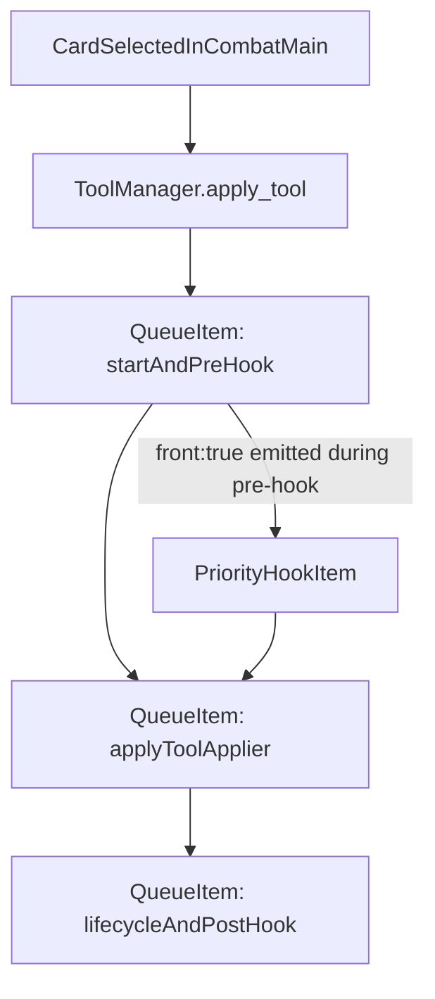

---
name: Field status queue adoption
overview: Split tool application into multiple queue items so pre-hooks/actions/lifecycle/post-hooks preserve current sequencing; defer field-status queue migration for a later phase.
todos:
  - id: split-tool-apply-stages
    content: Refactor ToolManager so apply flow is staged internally (pre-hook, apply actions/script, lifecycle, post-hook/error handling) without changing behavior.
    status: pending
  - id: queue-itemize-tool-play
    content: Move queue-item creation into ToolManager so CombatMain only calls apply_tool and ToolManager enqueues staged items.
    status: pending
  - id: preserve-ui-card-state
    content: Ensure card WAITING/SELECTED transitions and clear-selection timing remain correct across staged queue items.
    status: pending
  - id: staged-flow-tests
    content: Add/adjust tests for staged queue ordering and regression case (first card discards second while second is queued) with no freed-card crash.
    status: pending
isProject: false
---

# Split Tool Apply Into Queue Stages

## Goal
Keep current gameplay ordering semantics while using the queue, with `CombatMain` only calling `apply_tool` and `ToolManager` owning staged queue-item creation/execution.

## Why change
- Current queued tool play wraps the whole `ToolManager.apply_tool` in one queue item.
- Any `front:true` work emitted during pre-hook is processed only after that entire item finishes.
- This diverges from intended sequencing and caused fragile behavior around queued/discarded cards.

## Implementation plan

### 1) Refactor `ToolManager` into explicit apply stages
- In [scenes/main_game/tool/tool_manager.gd](/Users/cyang/works/current/garden/garden/scenes/main_game/tool/tool_manager.gd), add staged methods that preserve existing logic:
  - stage start/selection (`is_applying_tool`, `selected_tool`, `tool_application_started`)
  - pre-hook stage (`player_upgrades_manager.handle_pre_tool_application_hook`)
  - apply stage (`_tool_applier.apply_tool`)
  - success/lifecycle stage (`number_of_card_used_this_turn`, `tool_application_success`, `_run_card_lifecycle`)
  - completion/post-hook stage (`tool_application_completed`, script post hook, reset `is_applying_tool`)
  - error stage (`tool_application_error`, reset `is_applying_tool`)
- Keep `apply_tool` as the public entry point and make it schedule/run staged work through the combat queue manager.

### 2) Move queue-itemization responsibility into `ToolManager`
- In [scenes/main_game/combat/combat_main.gd](/Users/cyang/works/current/garden/garden/scenes/main_game/combat/combat_main.gd), keep UI selection handling but call only `tool_manager.apply_tool(self, tool_data)`.
- In [scenes/main_game/tool/tool_manager.gd](/Users/cyang/works/current/garden/garden/scenes/main_game/tool/tool_manager.gd), create and enqueue staged callable items (`front:false`) via combat queue APIs.
- Ensure stages remain independent queue items so `front:true` insertions can run between pre-hook and apply/lifecycle stages.

### 3) Keep field-status migration out of scope for now
- Do **not** change field-status trigger entry points in this pass.
- Continue using current `PlantFieldContainer` / `FieldStatusContainer` execution paths until staged tool flow is stable.

### 4) Preserve card UI semantics during staged execution
- Ensure queued card state transitions stay coherent:
  - queued backlog cards show `WAITING`
  - active stage card becomes `SELECTED` at execution
  - clear selection and error shake behavior remain unchanged
- Ensure queued-card dedupe/unmark bookkeeping remains correct when a staged sequence aborts.
- Keep dedupe tracking in `ToolManager` (single owner of apply + queue lifecycle).

### 5) Tests
- Extend queue tests in [tests/gut_tests/gameplay/test_combat_queue_manager.gd](/Users/cyang/works/current/garden/garden/tests/gut_tests/gameplay/test_combat_queue_manager.gd) for staged-item ordering.
- Add regression test(s) in [tests/gut_tests/gameplay](/Users/cyang/works/current/garden/garden/tests/gut_tests/gameplay):
  - first card can discard second while second is queued
  - second queued card is skipped safely (no freed-node type crash)
  - no crash at `ActionsApplier._apply_next_action` recursion.

## Sequencing target

## Rollout notes
- Keep staged refactor behavior-preserving first; avoid mixing with broad hook-system migration.
- Once staged queue behavior is stable, resume field-status queue adoption as a separate change.